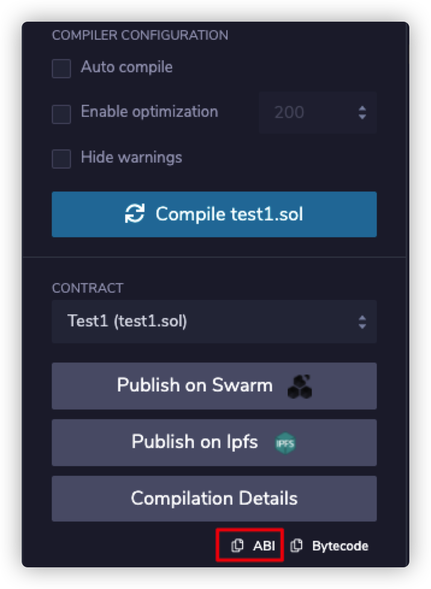

## 1. Generate transaction trace

### 1.1 Run okexchain local

```
cd okexchain
git checkout mxj/evm-debug
./tools/initevm_web3_rest.sh
```

### 1.2 Deploy test contract

1. Deploy `./contracts/test6.sol` 

2. Deploy `./contracts/test5.sol` with test6’s address

3. Deploy `./contracts/test4.sol` with test5’s address

4. Deploy `./contracts/test3.sol` with test4’s address

5. Deploy `./contracts/test2.sol` with test3’s address

6. Deploy `./contracts/test1.sol` with test2’s address

7. Call test1’s test1Revert with any address and get the `txhash`

8. Down load the repository

   ```
   git clone https://github.com/xiangjianmeng/display-evm-stack.git
   cd dispay-evm-stack
   mkdir traces
   cp ${path}/okexchain/tools/_cache_evm/traces/${txhash} ./traces
   ```
   
9. Find trace file in `./tools/_cache_evm/traces` according to the `txhash` and copy it to `./traces` of current repository


10. Copy abi of test2.sol from remix to `./build/contracts/test2.abi` and the same to test1.sol

   

## 2. Display the transaction call stack

### 2.1 Edit the `__main__.py`

```python
if __name__ == '__main__':
    if __name__ == '__main__':
    # web3.connect("http://okexchaintest-rpc2.okexcn.com:26659")
    web3.connect("http://127.0.0.1:8545")
    txhash = "0x52a3cdc7a9dbff8b61fd85dfc35f393eb022d22779cd1f0fc69491c3aee4b61a"

    resigter_contract("0x0d021d10ab9E155Fc1e8705d12b73f9bd3de0a36", "test6.abi")
    resigter_contract("0x1d29789a81aa381fE5830cd378Bb8F5c76E8C8a7", "test5.abi")
    resigter_contract("0xd84d4030880352B03F6746ACa893a4aF9EDC6134", "test4.abi")
    resigter_contract("0x48855b5882C30d6a2C926F9cb80782f58B10d497", "test3.abi")
    resigter_contract("0x55Ab234103Ec829a76D2a73e3456389e95387D4D", "test2.abi")
    resigter_contract("0xA4c1095732718699cf068BeD7CC780c175903b1e", "test1.abi")
```

1. Change the `txhash` to the hash of tx whose call stack to be displayed.
2. Register the contract through `resigter_contract`, arg[0] is the address of contract, arg[1] is the abi of contract. If thers is no corresponding abi of a contract, ignore arg[1]. It will only display the signature of the function without function name.

### 2.2 Run `__main__.py`

```
$ python3 __main__.py  
[
    {
        "from": "0xA4c1095732718699cf068BeD7CC780c175903b1e",
        "to": "0x55Ab234103Ec829a76D2a73e3456389e95387D4D",
        "op": "STATICCALL",
        "function": "test2Revert(address)",
        "inputs": {
            "tmp": "0x2CF4ea7dF75b513509d95946B43062E26bD88035"
        }
    },
    {
        "from": "0x55Ab234103Ec829a76D2a73e3456389e95387D4D",
        "to": "0x48855b5882C30d6a2C926F9cb80782f58B10d497",
        "op": "STATICCALL",
        "function": "test3Revert(address)",
        "inputs": {
            "tmp": "0x2CF4ea7dF75b513509d95946B43062E26bD88035"
        }
    },
    {
        "from": "0x48855b5882C30d6a2C926F9cb80782f58B10d497",
        "to": "0xd84d4030880352B03F6746ACa893a4aF9EDC6134",
        "op": "STATICCALL",
        "function": "test4Revert(address)",
        "inputs": {
            "tmp": "0x2CF4ea7dF75b513509d95946B43062E26bD88035"
        }
    },
    {
        "from": "0xd84d4030880352B03F6746ACa893a4aF9EDC6134",
        "to": "0x1d29789a81aa381fE5830cd378Bb8F5c76E8C8a7",
        "op": "STATICCALL",
        "function": "test5Revert(address)",
        "inputs": {
            "tmp": "0x2CF4ea7dF75b513509d95946B43062E26bD88035"
        }
    },
    {
        "from": "0x1d29789a81aa381fE5830cd378Bb8F5c76E8C8a7",
        "to": "0x0d021d10ab9E155Fc1e8705d12b73f9bd3de0a36",
        "op": "STATICCALL",
        "function": "test6Revert(address)",
        "inputs": {
            "tmp": "0x2CF4ea7dF75b513509d95946B43062E26bD88035"
        },
        "revert_msg": "0x08c379a00000000000000000000000000000000000000000000000000000000000000020000000000000000000000000000000000000000000000000000000000000002463616c6c2074657374365265766572742cf4ea7df75b513509d95946b43062e26bd8803500000000000000000000000000000000000000000000000000000000"
    }
]                                                                                                                                                
```

Every item in the stack represents that contract `from` calls the `function` of contract `to`.


